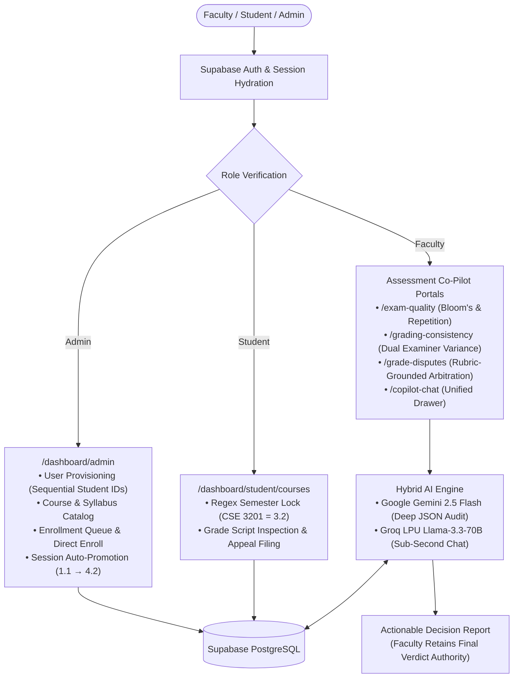
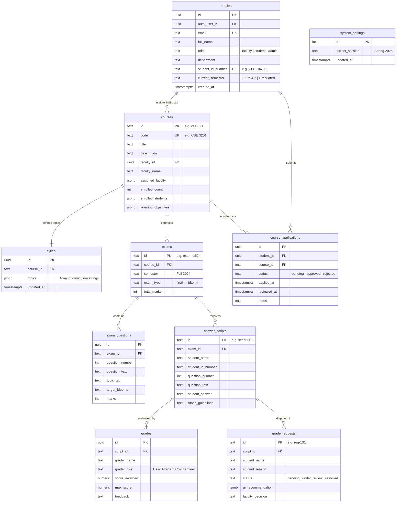

<div align="center">

# FacultyOS

### Intelligent Academic Decision-Support & Curriculum Operations System

> An AI-powered academic co-pilot engineered for university faculty, examination committees, and students at AUST.

[](https://nextjs.org/)
[](https://react.dev/)
[](https://tailwindcss.com/)
[](https://supabase.com/)
[](https://ai.google.dev/)
[](https://groq.com/)
[](https://aust.edu/)

</div>

---

## Quick Summary

**FacultyOS** is a comprehensive academic decision-support platform and administrative operating system tailored specifically for the undergraduate engineering curriculum, semester structure, and examination policies of Ahsanullah University of Science and Technology (AUST). Designed around the core ethos of *"augmenting faculty judgment rather than replacing it"*, FacultyOS eliminates high-friction academic bottlenecks: unintentional exam repetition from past archives, multi-examiner grading divergences on identical student answer scripts, contentious grade re-evaluation petitions, and manual semester registration errors. Powered by Google Gemini and Groq LPU acceleration alongside Supabase PostgreSQL, FacultyOS delivers objective, rubric-grounded audits and sub-second academic intelligence.

---

## Table of Contents

- [The Problem](#the-problem)
- [The Solution](#the-solution)
- [Feature Highlights](#feature-highlights)
- [Tech Stack](#tech-stack)
- [System Architecture](#system-architecture)
- [Database Schema & ER Diagram](#database-schema--er-diagram)
- [Security & Role-Based Access Control (RBAC)](#security--role-based-access-control-rbac)
- [Project Structure](#project-structure)
- [Getting Started & Setup](#getting-started--setup)
- [Pre-Seeded Judge Accounts](#pre-seeded-judge-accounts)
- [Academic Business Logic Rules](#academic-business-logic-rules)
- [The 2-Minute Winning Exhibition Demo Script](#the-2-minute-winning-exhibition-demo-script)
- [Development & Git Workflow](#development--git-workflow)
- [Troubleshooting](#troubleshooting)
- [Current Status & Hackathon Roadmap](#current-status--hackathon-roadmap)
- [Team](#team)

---

## The Problem

Undergraduate academic administration and examination management at AUST face four critical friction points:

1. **Assessment Repetition & Coverage Blindspots**: Faculty draft exam question papers under tight departmental deadlines without instant automated checks against historical past-semester question archives (e.g., Fall 2024). This results in inadvertent verbatim question repetition ($>65\%$ semantic overlap) and uneven syllabus coverage (e.g., over-testing Dynamic Programming while completely omitting Greedy Algorithms).
2. **Multi-Examiner Grading Discrepancy**: Standard university examination policy mandates co-examiners (Head Grader vs. Co-Grader). When Dr. Tanvir awards $10/15$ and Lecturer Hasan awards $4/15$ on the exact same student script (`script-001`), no automated system currently flags this severe $6.0$-mark divergence or identifies that an examiner unfairly penalized a missing sub-step contrary to rubric guidelines.
3. **Contentious Grade Appeals**: After exam results are released, students submit subjective regrade appeals (`grade_requests`). Faculty are overwhelmed by manual reviews without an objective, rubric-grounded second opinion that audits the student's handwritten answer against official marking criteria.
4. **Administrative Enrollment Friction**: Student course registration lacks automated semester validation. Students mistakenly petition for out-of-sequence courses, and departmental admins must manually track student progression across eight consecutive semesters ($1.1$ to $4.2$) without batch session promotion.

---

## The Solution

FacultyOS unifies curriculum management, student course petitions, and assessment evaluation into a single role-guarded platform:



---

## Feature Highlights

| Feature | Description | Status | Primary Implementation |
| :--- | :--- | :---: | :--- |
| **Exam Question Quality & Repetition Inspector** | Audits draft questions for syllabus coverage vector, Bloom's cognitive taxonomy, and flags $>65\%$ semantic repetition against past-year archives. | 🟢 Implemented | [src/app/exam-quality/page.tsx](file:///d:/Hackathon/src/app/exam-quality/page.tsx) |
| **Multi-Examiner Grading Consistency Checker** | Detects severe score divergence between Head Grader and Co-Examiner, isolates rubric deviations, and recommends mediated consensus marks. | 🟢 Implemented | [src/app/grading-consistency/page.tsx](file:///d:/Hackathon/src/app/grading-consistency/page.tsx) |
| **Student Grade Dispute & Rubric Advisory** | Impartial AI second opinion auditing student regrade petitions against answer scripts and marking rubrics before final grade entry. | 🟢 Implemented | [src/app/grade-disputes/page.tsx](file:///d:/Hackathon/src/app/grade-disputes/page.tsx) |
| **Unified Co-Pilot Chatbot Drawer** | Conversational front-door providing natural language queries over live course rosters, grading variances, and syllabus archives. | 🟢 Implemented | [src/app/copilot-chat/page.tsx](file:///d:/Hackathon/src/app/copilot-chat/page.tsx) |
| **Admin User Provisioning with Sequential Student IDs** | Provisions faculty and students using Supabase Auth Admin API with auto-incremented, non-colliding Student ID numbers (`21.01.04.099`, etc.). | 🟢 Implemented | [src/app/dashboard/admin/users/page.tsx](file:///d:/Hackathon/src/app/dashboard/admin/users/page.tsx) |
| **Dynamic Course Code Eligibility Parser** | Regex engine parsing course codes (`CSE 3201` $\rightarrow$ Semester `3.2`) to disable enrollment buttons with interactive lock tooltips for ineligible students. | 🟢 Implemented | [src/lib/semester-utils.ts](file:///d:/Hackathon/src/lib/semester-utils.ts) |
| **Session Settings & Auto-Promotion Matrix** | Advances academic sessions (`Spring 2025` $\rightarrow$ `Fall 2025`) and automatically cascades all student semester levels ($1.1 \rightarrow 4.2 \rightarrow \text{Graduated}$). | 🟢 Implemented | [src/app/dashboard/admin/settings/page.tsx](file:///d:/Hackathon/src/app/dashboard/admin/settings/page.tsx) |
| **Student Course Application & Enrollment Queue** | Real-time queue for admins to approve/reject student course petitions with automatic enrollment array and roster updates. | 🟢 Implemented | [src/app/dashboard/admin/enrollments/page.tsx](file:///d:/Hackathon/src/app/dashboard/admin/enrollments/page.tsx) |
| **Historical Exam Question Bank Archive** | Relational archive storing past examination papers, questions, target Bloom's levels, and syllabus topic tags. | 🟢 Implemented | `public.exams`, `public.exam_questions` |

**Status Legend:**
- 🟢 **Implemented**: Live, fully functional, and verified with zero build errors.
- 🟡 **In Progress**: UI scaffolded, active model prompt tuning or endpoint integration.
- 🔵 **Planned**: Scheduled for subsequent engineering phases.

---

## Tech Stack

### Frontend & Application Runtime
- **Framework**: [Next.js 15.1.7](https://nextjs.org/) (App Router, React Server Components, Server Actions)
- **Language**: [TypeScript 5.7.3](https://www.typescriptlang.org/) (Strict mode, zero `any` policy)
- **UI Library**: [React 19.0.0](https://react.dev/)
- **Styling**: [Tailwind CSS v4.0.7](https://tailwindcss.com/)
- **Design Primitives**: [shadcn/ui](https://ui.shadcn.com/) (New York style, Zinc neutral palette) + [Radix UI Primitives](https://www.radix-ui.com/)
- **Icons**: [lucide-react 0.475.0](https://lucide.dev/) (**Emojis as UI icons are strictly banned**)
- **Notifications**: [sonner 2.0.1](https://sonner.emilkowal.ski/) toast management

### Artificial Intelligence & Cognitive Engines
- **Deep Assessment Reasoning**: [Google Gemini 2.5 Flash](https://ai.google.dev/) (`@google/genai` 2.21.0) configured with strict JSON schemas (`responseMimeType: 'application/json'`).
- **Conversational LPU Acceleration**: [Groq SDK](https://groq.com/) (`llama-3.3-70b-versatile`) delivering sub-second interactive co-pilot dialogues.

### Backend, Database & Infrastructure
- **Database**: [Supabase](https://supabase.com/) PostgreSQL (Relational tables, Foreign Keys, JSONB structures)
- **Authentication**: Supabase Auth (Cookie-based SSR session management via `@supabase/ssr` 0.5.2)
- **Admin Operations**: `@supabase/supabase-js` 2.48.1 executed in isolated server actions with `SUPABASE_SERVICE_ROLE_KEY`
- **Security**: Row-Level Security (RLS) policies + Next.js Middleware route interception

---

## System Architecture

```mermaid
flowchart LR
    subgraph Client [Browser Client]
        Nav[Persistent Navbar]
        Portals[Role-Guarded Portals]
        Modals[Accessible Radix Dialogs]
        Toasts[Sonner Notification Toast]
    end

    subgraph Runtime [Next.js 15 App Router]
        Middleware["SSR Middleware Guard<br/>(src/lib/supabase/middleware.ts)"]
        AccessCtrl["Route RBAC Engine<br/>(src/lib/access-control.ts)"]
        SemUtils["Semester Regex Parser<br/>(src/lib/semester-utils.ts)"]
        AdminAct["Admin Server Actions<br/>(src/app/actions/admin.ts)"]
        StudentAct["Student Server Actions<br/>(src/app/actions/student.ts)"]
    end

    subgraph AI_Cloud [AI Engine Tier]
        Gemini["Google Gemini 2.5 Flash<br/>(Deep Examination JSON Audit)"]
        Groq["Groq LPU Llama-3.3-70B<br/>(Sub-Second Co-Pilot Chat)"]
    end

    subgraph Data [Supabase PostgreSQL Cloud]
        Profiles[(profiles)]
        Courses[(courses & syllabi)]
        Exams[(exams & exam_questions)]
        Grades[(answer_scripts & grades)]
        AppQueue[(course_applications)]
        Settings[(system_settings)]
    end

    Client <-->|HTTPS / Server Actions| Runtime
    Runtime <-->|Privileged Service Role| Data
    Runtime <-->|JSON Structured Prompts| AI_Cloud
```



---

## Database Schema & ER Diagram



---

## Security & Role-Based Access Control (RBAC)

1. **Route Guard Middleware** ([src/lib/supabase/middleware.ts](file:///d:/Hackathon/src/lib/supabase/middleware.ts)):
   - Intercepts all incoming requests to protected prefixes (`/dashboard`, `/exam-quality`, `/grading-consistency`, etc.).
   - Unauthenticated sessions are immediately redirected to `/auth` with the return redirect URL preserved.
   - Restricts `/dashboard/admin/*` strictly to `role === 'admin'`.
   - Restricts `/dashboard/student/*` to `role === 'student'` and `role === 'admin'`.
2. **Session Hydration with Fallback**:
   - Queries `profiles` by `auth_user_id = user.id`. If a pre-seeded account is not linked to an active auth UUID, it falls back to matching `email = user.email`, guaranteeing zero authentication deadlocks during live hackathon judging.
3. **Service Role Isolation**:
   - Privileged operations (creating Supabase Auth users, updating other profiles) are executed via `createAdminClient()` strictly inside Next.js Server Actions with `'server-only'` imports. `SUPABASE_SERVICE_ROLE_KEY` is never included in client JavaScript bundles.
4. **Faculty Evaluation Guard**:
   - Faculty accounts are strictly prohibited from viewing or querying student-submitted teacher evaluations (`public.evaluations`) to preserve student feedback anonymity.

---

## Project Structure

```text
FacultyOS/
├── src/
│   ├── app/
│   │   ├── actions/
│   │   │   ├── admin.ts                 # Privileged admin actions (provisioning, courses, session)
│   │   │   └── student.ts               # Student course application & constraint validation
│   │   ├── api/
│   │   │   └── auth/signup/route.ts     # User registration endpoint
│   │   ├── auth/
│   │   │   ├── [role]/login/page.tsx    # Role-based login routes
│   │   │   ├── [role]/signup/page.tsx   # Role-based signup routes
│   │   │   └── page.tsx                 # Auth landing hub
│   │   ├── copilot-chat/page.tsx        # Unified Front-Door AI Co-Pilot chat
│   │   ├── dashboard/
│   │   │   ├── admin/
│   │   │   │   ├── courses/page.tsx     # Course catalog & faculty assignments
│   │   │   │   ├── enrollments/page.tsx # Student petition review & direct enrollment
│   │   │   │   ├── settings/page.tsx    # Session management & auto-promotion
│   │   │   │   ├── users/page.tsx       # Faculty & student user provisioning
│   │   │   │   └── page.tsx             # System Administrator Overview Command Center
│   │   │   └── student/
│   │   │       └── courses/page.tsx     # Student course registration & semester constraint lock
│   │   ├── exam-quality/page.tsx        # Core Skill 1: Exam Question Quality & Repetition
│   │   ├── grading-consistency/page.tsx # Core Skill 2: Multi-Grader Consistency Checker
│   │   ├── grade-disputes/page.tsx      # Core Skill 3: Grade Dispute & Appeal Advisory
│   │   ├── globals.css                  # Tailwind CSS v4 & design tokens
│   │   ├── layout.tsx                   # Root layout with Toaster & ThemeProvider
│   │   └── page.tsx                     # Landing page & value proposition
│   ├── components/
│   │   ├── admin/
│   │   │   ├── AssignFacultyModal.tsx   # Faculty instructor assignment modal
│   │   │   ├── CourseCatalogManager.tsx # Course catalog table & grid manager
│   │   │   ├── CourseRosterViewer.tsx   # Active course cohort viewer with revocation
│   │   │   ├── CreateCourseModal.tsx    # Course & syllabus initialization modal
│   │   │   ├── CreateFacultyModal.tsx   # Faculty account provisioning modal
│   │   │   ├── CreateStudentModal.tsx   # Student account provisioning modal
│   │   │   ├── DirectEnrollModal.tsx    # Manual direct enrollment modal
│   │   │   ├── EditCourseModal.tsx      # Course title & description editor
│   │   │   ├── EnrollmentManager.tsx    # Applications queue adjudication manager
│   │   │   ├── SessionSettingsManager.tsx# Active session & auto-promotion manager
│   │   │   └── UserDirectoryManager.tsx # Accounts directory table with filters
│   │   ├── auth/AuthButton.tsx          # Dynamic sign-in / sign-out button
│   │   ├── student/
│   │   │   └── StudentCourseApplicationView.tsx # Student course catalog with semester constraints
│   │   ├── ui/                          # shadcn/ui primitives (badge, button, dialog, table, tabs, skeleton)
│   │   ├── mode-toggle.tsx              # Light / Dark mode toggle
│   │   ├── theme-provider.tsx           # Next-themes wrapper
│   │   └── Navbar.tsx                   # Role-aware persistent navigation bar
│   └── lib/
│       ├── access-control.ts            # Route permission mapping & role home resolution
│       ├── auth-roles.ts                # Role type helpers & cookie hydration
│       ├── semester-utils.ts            # Course code parser & semester progression logic
│       ├── utils.ts                     # cn() class merge utility
│       └── supabase/
│           ├── admin.ts                 # Service-role admin client (server-only)
│           ├── client.ts                # Browser Supabase client
│           ├── config.ts                # Environment keys & configuration
│           ├── middleware.ts            # SSR session refresh & route redirect
│           ├── server.ts                # Server component Supabase client
│           └── types.ts                 # TypeScript interfaces for all Supabase tables
├── supabase/
│   ├── admin_portal.sql                 # Course applications & faculty_id migration
│   ├── admin_provisioning.sql           # Student ID numbers, semesters & system_settings migration
│   ├── auth.sql                         # Authentication helper functions
│   ├── full_setup.sql                   # Complete relational setup script
│   ├── schema.sql                       # Core schema DDL
│   └── seed.sql                         # Realistic demo seed data
├── scripts/
│   ├── seed-admin.mjs                   # Admin user seed utility
│   ├── test-auth.mjs                    # Authentication test harness
│   └── test-supabase.mjs                # Supabase table connectivity audit
├── BATTLE_PLAN.md                       # Task-by-task execution guide & demo script
├── AGENTS.md                            # Universal AI coding agent rules
├── projectdetails.md                    # System Architecture & Source of Truth
└── README.md                            # Public setup & judging instructions
```

---

## Getting Started & Setup

### Prerequisites
- **Node.js**: `v20.x` or `v22.x` (LTS recommended)
- **Package Manager**: `npm` (v10+)
- **Supabase Account**: A PostgreSQL project on [supabase.com](https://supabase.com)
- **Google AI Studio API Key**: For Gemini models from [aistudio.google.com](https://aistudio.google.com/)
- **Groq API Key**: For sub-second Llama 3.3 models from [console.groq.com](https://console.groq.com/)

### 1. Clone & Install
```bash
git clone https://github.com/Partha509/AI_Hackathon.git
cd AI_Hackathon
npm install
```

### 2. Configure Environment Variables
Create `.env.local` in the project root:
```env
NEXT_PUBLIC_SUPABASE_URL="https://your-project.supabase.co"
NEXT_PUBLIC_SUPABASE_ANON_KEY="your-anon-key"
SUPABASE_SERVICE_ROLE_KEY="your-server-only-service-role-key"
GEMINI_API_KEY="your-google-gemini-api-key"
GROQ_API_KEY="your-groq-api-key"
```

### 3. Supabase Database Migration
Open your Supabase project's **SQL Editor** and execute the migration scripts in the following order:
1. `supabase/full_setup.sql` — Creates base tables (`profiles`, `courses`, `syllabi`, `exams`, `exam_questions`, `answer_scripts`, `grades`, `grade_requests`) and loads seed data.
2. `supabase/admin_portal.sql` — Adds `courses.faculty_id` and creates `public.course_applications`.
3. `supabase/admin_provisioning.sql` — Adds `student_id_number`, `current_semester`, and creates `public.system_settings`.

### 4. Run Development Server
```bash
npm run dev
```
Open **`http://localhost:3000`** in your browser.

### 5. Verify Production Build
```bash
npm run build
```
Verify zero TypeScript and route compilation errors across all static and dynamic endpoints.

---

## Pre-Seeded Judge Accounts

All accounts use the standard test password: **`Aust1234!`**

| Role | Email | Full Name | Academic Placement / Role Context |
| :--- | :--- | :--- | :--- |
| **System Admin** | `admin@facultyos.edu` | System Administrator | Full administrative authority across all departmental portals |
| **Lead Faculty** | `tanvir.cse@aust.edu` | Dr. Tanvir Rahman | Primary Instructor for `CSE 321 Algorithms`, Head Examiner |
| **Co-Examiner** | `hasan.cse@aust.edu` | Lecturer Hasan Mahmud | Co-Grader for `CSE 321 Algorithms` (Grades script-001) |
| **Student (3.2)** | `sabbir.210104099@aust.edu` | Sabbir Ahmed | Student ID `21.01.04.101`, Enrolled in Semester `3.2` |
| **Student (Alt)** | `student@facultyos.edu` | Sabbir Ahmed (Test) | Student ID `21.01.04.102`, Enrolled in Semester `3.2` |

---

## Academic Business Logic Rules

### 1. Dynamic Course Code Regex Parser ([src/lib/semester-utils.ts](file:///d:/Hackathon/src/lib/semester-utils.ts))
AUST undergraduate course codes follow strict institutional numbering:
$$\text{[Department Code]}\quad\text{[Year Digit]}\text{[Semester Digit]}\text{[Course Number]}$$
- `CSE 3201` $\rightarrow$ Year **3**, Semester **2** $\rightarrow$ **Semester 3.2**
- `CSE 321` $\rightarrow$ Year **3**, Semester **2** $\rightarrow$ **Semester 3.2**
- `CSE 1100` $\rightarrow$ Year **1**, Semester **1** $\rightarrow$ **Semester 1.1**
- `CSE 4200` $\rightarrow$ Year **4**, Semester **2** $\rightarrow$ **Semester 4.2**

**Enforcement**: On the Student Course Application page (`/dashboard/student/courses`), if a course's parsed semester does not match the student's `current_semester`, the "Apply" button is locked with a tooltip:
> *"You can only apply to courses in semester [3.2]. Your current semester is [student.current_semester]."*

### 2. Automatic Semester Progression Matrix
When the administrator clicks **"Start New Semester Session"** on `/dashboard/admin/settings`:
- The active session advances (e.g. `Spring 2025` $\rightarrow$ `Fall 2025`).
- All undergraduate student profiles logically advance without data re-entry:
  $$1.1 \longrightarrow 1.2 \longrightarrow 2.1 \longrightarrow 2.2 \longrightarrow 3.1 \longrightarrow 3.2 \longrightarrow 4.1 \longrightarrow 4.2 \longrightarrow \text{Graduated}$$

---

## The 2-Minute Winning Exhibition Demo Script

```
⏱️ 0:00 - 0:30 | Step 1: Admin Command Center & Session Promotion
• Sign in as admin@facultyos.edu.
• Point out the live metric counters: Offered Courses, Faculty, Students, Pending Applications.
• Open /dashboard/admin/users: Show provisioned students with distinct, immutable Student ID numbers (21.01.04.099).
• Open /dashboard/admin/settings: Showcase the Student Distribution Matrix across semesters 1.1 to 4.2.
• Click "Start New Semester Session", type "ADVANCE SEMESTER", and demonstrate auto-promotion across all active cohorts.

⏱️ 0:30 - 0:55 | Step 2: Student Semester Constraint & Dispute Trigger
• Switch to student sabbir.210104099@aust.edu (Semester 3.2).
• Open /dashboard/student/courses:
  - CSE 3201 (Semester 3.2) is green and ELIGIBLE to apply.
  - CSE 4200 (Semester 4.2) is LOCKED with an informative lock tooltip.
• Open Graded Scripts: Inspect Script #001 where Co-Examiner awarded 4.0/15.0 and submit an appeal petition (req-101).

⏱️ 0:55 - 1:30 | Step 3: Exam Quality Inspector & Past Repetition Check
• Sign in as faculty lead tanvir.cse@aust.edu.
• Navigate to /exam-quality: Click "Load Sample Draft Exam" for CSE 321.
• Click "Inspect Assessment Quality":
  - Gemini detects 88% Repetition on Question 1 vs. the Fall 2024 Exam archive (MST uniqueness proof).
  - Coverage bar highlights that Dynamic Programming was over-tested while Greedy Algorithms was omitted from the syllabus.

⏱️ 1:30 - 1:50 | Step 4: Multi-Grader Consistency Reconciliation
• Navigate to /grading-consistency: Select Script #001 (Sabbir Ahmed).
• Highlight the 6-mark divergence: Dr. Tanvir awarded 10/15 while Lecturer Hasan awarded 4/15.
• Click "Compare Graders": AI diagnoses that Lecturer Hasan applied an overly harsh penalty for missing backtracking, violating the rubric breakdown. AI recommends a mediated mark of 9.5 / 15.0.

⏱️ 1:50 - 2:00 | Step 5: Groq-Powered Co-Pilot Front-Door
• Open /copilot-chat: Ask "Which courses in CSE have missing syllabus topics?"
• Groq LPU delivers sub-second conversational synthesis over live database archives.
```

---

## Development & Git Workflow

### Conventional Commits
All team members adhere strictly to conventional commits:
- `feat:` New features, endpoints, or UI views
- `fix:` Bug fixes, schema patches, or type corrections
- `chore:` Dependency updates, configurations
- `docs:` Documentation updates, architecture notes

### Branch Naming Policy
- `feat/feature-name` (e.g., `feat/admin-portal`, `feat/ai-academic-core`)
- `fix/bug-name` (e.g., `fix/unique-student-id-constraint`)

### Clean Repository Rules
- Never commit `.env`, `.env.local`, or secrets.
- Always run `npx tsc --noEmit` and `npm run build` prior to merging into `main`.

---

## Troubleshooting

### 1. Unique Key Violation on `student_id_number`
- **Cause**: Attempting to update multiple students with the same static ID.
- **Fix**: Run `supabase/admin_provisioning.sql` which utilizes `ROW_NUMBER()` to generate distinct sequential IDs (`21.01.04.099`, `21.01.04.100`, etc.).

### 2. Missing `SUPABASE_SERVICE_ROLE_KEY` Error
- **Cause**: Server action invoking administrative operations without the service key.
- **Fix**: Verify `.env.local` contains `SUPABASE_SERVICE_ROLE_KEY`.

### 3. Middleware Infinite Redirect Loop
- **Cause**: Path matching redirecting to `/auth` which triggers another redirect.
- **Fix**: [src/lib/supabase/middleware.ts](file:///d:/Hackathon/src/lib/supabase/middleware.ts) excludes public assets and auth paths (`/auth`, `/_next`, `/api`, `/favicon.ico`).

---

## Current Status & Hackathon Roadmap

- [x] **Phase 0: Foundation & Design System** (Next.js 15, Tailwind CSS v4, Academic Navy/Amber tokens, shadcn/ui).
- [x] **Phase 1: Relational Schema & Realistic Seeding** (Profiles, courses, syllabi, exam archives, grades, scripts).
- [x] **Phase 2: Authentication & RBAC Engine** (Supabase Auth, SSR Middleware, dynamic identity badges).
- [x] **Phase 3: Administrator Command Center** (Course creation, faculty assignment, student provisioning, session auto-promotion).
- [x] **Phase 4: Academic Constraint Engine** (Course code regex parser, semester lock tooltips, enrollment queue).
- [x] **Phase 5: AI Assessment Reasoning Interfaces** (Exam Quality, Consistency Checker, Dispute Advisory, Co-Pilot Chat).
- [ ] **Phase 6: Live Final Exhibition & Judging Deployment** (Vercel Production Deployment, Live Demo).

---

## Team

**Team: AI_Hackathon / FacultyOS**  
*AUST CSE Carnival <8.0/> — AI Build Hackathon Finalist*

- **Md. Tanjimul Islam** — *Full-Stack Engineering & System Architecture*
- **Enid Hasan** — *Frontend Architecture & UI/UX Engineering*
- **Partha Saha** — *Backend Engineering & Database Architecture*

---

<div align="center">
  <sub>Built with academic integrity for the Department of Computer Science & Engineering, Ahsanullah University of Science and Technology (AUST).</sub>
</div>