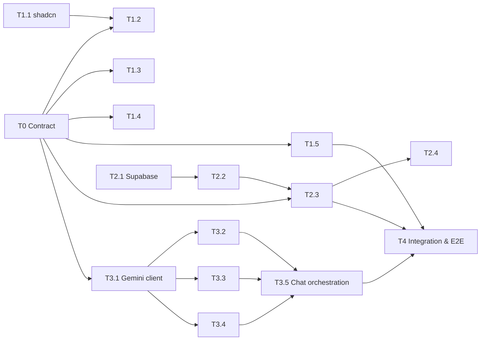

# FacultyOS — Parallel Task Board

Three people, three tracks, **one shared contract**. Every prompt below is written to be pasted directly into Copilot Agent / Antigravity. Work top-to-bottom inside your own track.

| Person | Track | Owns these paths (nobody else edits them) |
|---|---|---|
| **P1 — UI** | Frontend | `src/app/**/page.tsx`, `src/components/**`, `src/app/globals.css`, `src/hooks/**` |
| **P2 — Data** | Supabase + backend | `supabase/**`, `src/lib/supabase/**`, `src/lib/db/**`, `src/app/api/data/**`, `.env.example` |
| **P3 — AI + QA** | Chatbot + skills + testing | `src/lib/ai/**`, `src/app/api/skills/**`, `src/app/api/chat/**`, `tests/**` |
| **Shared (T0 only)** | Contract | `src/lib/types.ts`, `src/lib/mock-data.ts` — written once in T0, then **append-only** with a Discord/WhatsApp ping |

### Rules that keep us unblocked
1. **T0 is the only hard dependency.** P3 does it in the first 15 minutes while P1/P2 do their setup tasks. After T0 everyone codes against `src/lib/types.ts` + `src/lib/mock-data.ts`, not against each other's unfinished work.
2. **Mock toggle**: when `NEXT_PUBLIC_USE_MOCK=true`, every API route returns data from `mock-data.ts`. P1 never waits for P2/P3.
3. **Never edit another person's paths.** If you need something from another track, add a `TODO(P2):` comment and ping them.
4. **After finishing each task**: run `npm run build` (must pass), then append a line to [PROGRESS.md](PROGRESS.md) and any known gaps to [LIMITATIONS.md](LIMITATIONS.md). Commit with message `T<id>: <summary>`. Pull before you push.
5. Follow [AGENTS.md](AGENTS.md) + the skills in `.agents/skills/` (lucide icons only, 4 UI states, WCAG AA, faculty disclaimer on every AI output).

### Dependency graph (arrows = "needs")



---

## Phase 0 — Kickoff (first 15 min, all three in parallel)

### T0 · Shared contract (P3) — `src/lib/types.ts`, `src/lib/mock-data.ts`, `.env.example`
> **Prompt:**
> Create `src/lib/types.ts` exporting these TypeScript types, matching `supabase/schema.sql` column names exactly (snake_case):
> - Row types: `Profile`, `Course` (with `learning_objectives: CLO[]` where `CLO = { clo: string; description: string; blooms_level: BloomsLevel }`), `Syllabus`, `Exam`, `ExamQuestion`, `AnswerScript`, `Grade`, `GradeRequest` (with `ai_recommendation: DisputeAdvisory | null`), `ChatLog`.
> - `BloomsLevel = 'Remember'|'Understand'|'Apply'|'Analyze'|'Evaluate'|'Create'`.
> - Skill **inputs**: `ExamQualityInput = { course_id: string; semester: string; questions: { question_number: number; question_text: string; marks: number }[] }`, `ConsistencyInput = { script_id: string }`, `DisputeInput = { request_id: string }`.
> - Skill **outputs**: `ExamQualityReport = { summary: string; coverage: { topic: string; covered: boolean; question_numbers: number[] }[]; coverage_percent: number; blooms_distribution: Record<BloomsLevel, number>; clo_alignment: { clo: string; question_numbers: number[]; aligned: boolean }[]; repetitions: { question_number: number; past_exam_id: string; past_question_number: number; similarity: number; explanation: string }[]; per_question: { question_number: number; detected_blooms: BloomsLevel; detected_topic: string; issues: string[] }[]; recommendations: string[] }`.
>   `ConsistencyReport = { script_id: string; graders: { grader_name: string; score_awarded: number; max_score: number; feedback: string }[]; variance: number; variance_flag: 'low'|'moderate'|'high'; rubric_breakdown: { criterion: string; max_points: number; ai_assessment: number; evidence: string }[]; ai_suggested_score: number; reasoning_gap: string; recommendation: string }`.
>   `DisputeAdvisory = { request_id: string; recommendation: 'uphold'|'partial_regrade'|'full_regrade'; confidence: number; reasoning: string; suggested_delta: number; suggested_score: number; rubric_evidence: { criterion: string; student_met: boolean; note: string }[]; student_claim_assessment: string }`.
> - Chat: `ChatRole = 'user'|'assistant'|'tool'`, `ToolName = 'check_exam_quality'|'check_grading_consistency'|'advise_grade_dispute'|'query_database'`, `ToolInvocation = { id: string; tool: ToolName; args: Record<string, unknown>; status: 'running'|'done'|'error'; result?: unknown }`, `ChatMessage = { id: string; role: ChatRole; content: string; tool_invocations?: ToolInvocation[]; created_at: string }`, `ChatRequest = { messages: ChatMessage[] }`, `ChatResponse = { message: ChatMessage }`.
> - Generic `ApiResult<T> = { ok: true; data: T } | { ok: false; error: string }`.
>
> Create `src/lib/mock-data.ts` exporting realistic fixtures typed with the above: `MOCK_COURSE` (CSE 321 from seed), `MOCK_EXAMS`, `MOCK_PAST_QUESTIONS` (the 3 Fall 2024 seed questions), `MOCK_NEW_QUESTIONS` (4 Spring 2025 questions, one of which is a near-duplicate of the Knapsack question), `MOCK_SCRIPT` (script-001), `MOCK_GRADES` (Dr. Tanvir 10/15, Lecturer Hasan 4/15), `MOCK_REQUEST`, and fully-populated `MOCK_EXAM_QUALITY_REPORT`, `MOCK_CONSISTENCY_REPORT`, `MOCK_DISPUTE_ADVISORY`, `MOCK_CHAT_MESSAGES` (a 4-message conversation including one tool invocation).
>
> Create `.env.example` with `NEXT_PUBLIC_SUPABASE_URL=`, `NEXT_PUBLIC_SUPABASE_ANON_KEY=`, `SUPABASE_SERVICE_ROLE_KEY=`, `GEMINI_API_KEY=`, `GEMINI_MODEL=gemini-2.0-flash`, `NEXT_PUBLIC_USE_MOCK=true`.
>
> Run `npm run build`. Update PROGRESS.md and LIMITATIONS.md. Commit as `T0: shared contract`. **Ping the team the moment this is pushed.**

### T1.1 · Install shadcn primitives (P1) — no dependency
> **Prompt:**
> Using the existing `components.json`, add these shadcn/ui components via `npx shadcn@latest add`: `card badge tabs textarea input select skeleton dialog sheet progress table separator scroll-area alert tooltip label dropdown-menu`. Ensure `sonner` `<Toaster />` is mounted once in `src/app/layout.tsx`. Verify `npm run build` passes and dark mode tokens from `globals.css` are respected (check one component in both themes). Do not modify page files yet. Update PROGRESS.md; commit `T1.1: shadcn primitives`.

### T2.1 · Supabase project + fixed schema/seed (P2) — no dependency
> **Prompt:**
> Create a Supabase project. Fix these bugs in `supabase/seed.sql` before running: (a) `grade_requests.id` is `UUID` but seed inserts `'req-101'` — change the schema column to `TEXT PRIMARY KEY` in `supabase/schema.sql` so human-readable IDs work in demos; (b) `syllabi` and `exam_questions`/`grades` inserts lack `ON CONFLICT` guards — make the seed idempotent (delete-then-insert by known IDs or add unique constraints). Then **enrich the seed**: add 4 Spring 2025 questions for `exam-cse321-s25` (one near-duplicate of the Fall 2024 Knapsack question, one off-syllabus question on "Quantum Computing", varied Bloom's levels), a second answer script `script-002` with two graders who **agree** (control case), and a second grade request `req-102` on `script-002`. Add a second course `cse-411` (Machine Learning) with syllabus and one past exam so course selection is meaningful. Because the app has no auth, add RLS policies granting `anon` role `SELECT` on all tables and `INSERT/UPDATE` on `grade_requests` and `chat_logs` (document this in LIMITATIONS.md as hackathon-only). Run schema then seed in the SQL editor; verify row counts with a query and paste them into PROGRESS.md. Create `.env.local` (never commit it). Commit `T2.1: supabase schema+seed`.

---

## Phase 1 — Parallel build (each track independent after T0)

## Track P1 — UI (needs only T0 + T1.1)

### T1.2 · Exam Quality page
> **Prompt:**
> Rebuild `src/app/exam-quality/page.tsx` as a functional page. Create `src/hooks/use-skill.ts` — a generic client hook `useSkill<TIn, TOut>(endpoint)` returning `{ run(input), data, error, isLoading, reset }` that POSTs JSON to `endpoint` and expects `ApiResult<TOut>` from `src/lib/types.ts`. Create `src/components/exam-quality/`: `ExamInputForm.tsx` (course `<Select>` fed by `GET /api/data/courses` — fall back to `MOCK_COURSE` if the request fails, semester input, a `<Textarea>` where faculty pastes one question per line in format `Q1. text ... [10 marks]`, parse into `ExamQualityInput.questions`), `CoverageProgress.tsx` (topic list with covered/uncovered badges + `<Progress>`), `BloomsDistribution.tsx` (horizontal bars per level), `RepetitionAlerts.tsx` (`<Alert>` per repetition, similarity as percentage badge: ≥85% destructive, 60–84% warning), `QuestionAuditTable.tsx` (shadcn `<Table>`, one row per question with detected Bloom's, topic, issues). Compose a split-pane layout: form left (sticky), report right; stack on `<lg`. Implement all 4 states: Loading (`<Skeleton>` mirroring the report shape), Empty (illustrated prompt to paste questions), Error (`<Alert variant="destructive">` with retry), Populated. Show the faculty disclaimer footer on every report. Render `MOCK_EXAM_QUALITY_REPORT` when `NEXT_PUBLIC_USE_MOCK=true` so this works with no backend. Use lucide-react icons only. Build must pass. Update PROGRESS/LIMITATIONS; commit `T1.2: exam quality UI`.

### T1.3 · Grading Consistency page
> **Prompt:**
> Rebuild `src/app/grading-consistency/page.tsx`. Components in `src/components/grading-consistency/`: `ScriptPicker.tsx` (select from `GET /api/data/scripts`, fallback to `MOCK_SCRIPT`), `ScriptViewer.tsx` (question, student answer in `<ScrollArea>`, rubric in a collapsible), `GraderComparison.tsx` (two side-by-side `<Card>`s — one per grader — score as large number, feedback, with a centered variance pill: `low` emerald, `moderate` amber, `high` destructive), `RubricBreakdownTable.tsx` (criterion, max, AI assessment, evidence), `ReasoningGap.tsx` (AI's explanation of why graders diverged + suggested score + recommendation). Use `useSkill<ConsistencyInput, ConsistencyReport>('/api/skills/consistency')`. 4 states, disclaimer, mock toggle, responsive (cards stack on mobile). Commit `T1.3: grading consistency UI`.

### T1.4 · Grade Disputes page
> **Prompt:**
> Rebuild `src/app/grade-disputes/page.tsx` as a master-detail view. Left: `DisputeList.tsx` from `GET /api/data/grade-requests` (fallback `MOCK_REQUEST`), each row shows student, script, status `<Badge>`. Right: `DisputeDetail.tsx` with tabs — "Student Claim" (reason text + original grades), "AI Advisory" (runs `useSkill<DisputeInput, DisputeAdvisory>('/api/skills/dispute')`; shows recommendation badge (`uphold` neutral / `partial_regrade` amber / `full_regrade` primary), confidence `<Progress>`, suggested delta with +/- sign coloring, `rubric_evidence` checklist with check/x icons, reasoning), "Faculty Decision" (textarea + Accept AI / Override buttons that `PATCH /api/data/grade-requests/[id]` with `{ status: 'resolved', faculty_decision }`, toast on success via sonner). 4 states, disclaimer, mobile: list collapses into a `<Sheet>`. Commit `T1.4: grade disputes UI`.

### T1.5 · Co-Pilot chat UI
> **Prompt:**
> Rebuild `src/app/copilot-chat/page.tsx` as a client component using `src/components/chat/`: `ChatMessageList.tsx` (auto-scrolls; user bubbles right, assistant left; renders markdown-lite: bold, lists, code), `ToolInvocationBadge.tsx` (inline pill per `ToolInvocation`: spinner while `running`, check when `done`, x on `error`; click expands a `<Dialog>` with pretty-printed JSON result), `QuickPrompts.tsx` (chips: "Audit Spring 2025 CSE 321 exam", "Compare graders on script-001", "Advise on dispute req-101", "How many pending disputes?"), `ChatComposer.tsx` (textarea, Enter to send, Shift+Enter newline, disabled while loading). State lives in `src/hooks/use-chat.ts`: appends user message, POSTs `ChatRequest` to `/api/chat`, appends returned `ChatResponse.message`; optimistic "thinking…" placeholder; error → toast + retry button on the failed message. Mock toggle returns `MOCK_CHAT_MESSAGES`. Persist conversation in `sessionStorage`. Disclaimer under the composer. Full-height layout, mobile safe. Commit `T1.5: chat UI`.

### T1.6 · Home dashboard + polish pass
> **Prompt:**
> Update `src/app/page.tsx`: add a "Live Stats" strip under the hero that reads `GET /api/data/stats` (`{ courses, exams, scripts, pending_disputes }`) with skeletons and mock fallback. Then do a global polish pass: consistent page headers (title + description + icon), focus-visible rings on every interactive element, `aria-live="polite"` on report containers, `prefers-reduced-motion` respected, 44px min tap targets on mobile, verify contrast in dark mode against `.agents/skills/wcag-accessibility`. Lighthouse accessibility ≥ 90 on all 5 routes. Commit `T1.6: dashboard + a11y polish`.

---

## Track P2 — Supabase & backend (needs T2.1; T2.3 also needs T0)

### T2.2 · Supabase clients
> **Prompt:**
> Create `src/lib/supabase/server.ts` exporting `createServerSupabase()` using `@supabase/ssr` `createServerClient` with Next 15 `cookies()` (await it), and `src/lib/supabase/admin.ts` exporting `createAdminSupabase()` using the service-role key — mark file `import 'server-only'`. Create `src/lib/supabase/client.ts` with `createBrowserClient` for any client-side needs. Add `src/lib/env.ts` that validates required env vars at import time with clear error messages (no zod — plain checks). Build passes. Commit `T2.2: supabase clients`.

### T2.3 · Typed data-access layer
> **Prompt:**
> Create `src/lib/db/` with one file per domain, every function server-only, returning types from `src/lib/types.ts`, throwing on Supabase error with the message included: `courses.ts` → `listCourses()`, `getCourseWithSyllabus(course_id)`; `exams.ts` → `listExams(course_id?)`, `getExamQuestions(exam_id)`, `getPastQuestionsForCourse(course_id, exclude_exam_id?)`; `scripts.ts` → `listScripts()`, `getScriptWithGrades(script_id)` returning `{ script: AnswerScript; grades: Grade[] }`; `requests.ts` → `listGradeRequests(status?)`, `getGradeRequestFull(request_id)` returning `{ request: GradeRequest; script: AnswerScript; grades: Grade[] }`, `updateGradeRequest(id, patch)`, `saveAiRecommendation(id, advisory)`; `chat.ts` → `logChat(entry)`; `stats.ts` → `getStats()`. Add `src/lib/db/index.ts` re-exporting everything. When `NEXT_PUBLIC_USE_MOCK=true`, each function returns the matching fixture from `mock-data.ts` instead of hitting Supabase (single `if (env.useMock)` at the top of each function). Write a tiny script `scripts/smoke-db.ts` (run with `npx tsx`) that calls every function and prints row counts. Commit `T2.3: db layer`.

### T2.4 · Data API routes
> **Prompt:**
> Create Next 15 route handlers (all `export const dynamic = 'force-dynamic'`, respond with `ApiResult<T>`, catch errors → `{ ok:false, error }` with status 500, validate params → 400): `GET /api/data/courses`, `GET /api/data/exams?course_id=`, `GET /api/data/exams/[id]/questions`, `GET /api/data/scripts`, `GET /api/data/scripts/[id]`, `GET /api/data/grade-requests?status=`, `GET /api/data/grade-requests/[id]`, `PATCH /api/data/grade-requests/[id]` (body `{ status?, faculty_decision? }`, whitelist fields), `GET /api/data/stats`. Use the db layer only — no Supabase calls in routes. Test each with `wget -qO- http://localhost:3000/api/data/...` and paste sample output into PROGRESS.md. Commit `T2.4: data API`.

### T2.5 · Chat logging + Vercel deploy prep
> **Prompt:**
> Add `POST /api/data/chat-logs` wrapping `logChat`. Add `vercel.json` if needed and confirm `npm run build` passes with `NEXT_PUBLIC_USE_MOCK=false` and real env vars. Deploy to Vercel (preview), set all env vars in the Vercel dashboard, confirm `/api/data/stats` returns live data. Write the deploy steps + preview URL into PROGRESS.md. Commit `T2.5: deploy`.

### T2.6 · (Stretch) Tier-2 seed data
> **Prompt:**
> Add tables `course_feedback` (course_id, semester, comment TEXT, rating INT) and seed 20 realistic student comments for CSE 321 with mixed sentiment, plus a `draft_syllabi` table for the Curriculum Overlap skill. Add `getFeedback(course_id)` and `listDraftSyllabi()` to the db layer and `GET /api/data/feedback?course_id=`. Commit `T2.6: tier-2 data`.

---

## Track P3 — AI skills, chatbot, QA (needs T0; uses mocks until T2.3 lands)

### T3.1 · Gemini client + structured output helper
> **Prompt:**
> Create `src/lib/ai/gemini.ts` (server-only) exporting `getGemini()` (singleton from `@google/genai` using `GEMINI_API_KEY`, model from `GEMINI_MODEL` default `gemini-2.0-flash`) and `generateJson<T>(opts: { system: string; user: string; schema: object; temperature?: number })` that calls Gemini with `responseMimeType: 'application/json'` + `responseSchema`, parses, and retries once on parse failure. Add `src/lib/ai/schemas.ts` with Gemini-compatible JSON schemas (OpenAPI subset) for `ExamQualityReport`, `ConsistencyReport`, `DisputeAdvisory`. Add `src/lib/ai/prompts.ts` with a shared `FACULTY_SYSTEM_PREAMBLE` ("You are an advisory co-pilot; faculty make final decisions; cite rubric text verbatim; never invent data"). Write `scripts/smoke-ai.ts` that generates a trivial JSON and prints it. Commit `T3.1: gemini client`.

### T3.2 · Skill: Exam Quality & Repetition
> **Prompt:**
> Create `src/lib/ai/skills/exam-quality.ts` exporting `runExamQuality(input: ExamQualityInput, ctx: { course: Course; syllabus_topics: string[]; past_questions: ExamQuestion[] }): Promise<ExamQualityReport>`. Prompt must: map each question to a syllabus topic + Bloom's level + CLO, compute coverage %, and compare every new question against every past question for **semantic** repetition (similarity 0–1 with a one-sentence explanation) — flag ≥0.6. Compute `coverage_percent` and `blooms_distribution` in TypeScript from the model's per-question output (don't trust the model's arithmetic). Create `POST /api/skills/exam-quality` that loads context via `src/lib/db` (falls back to mocks under the toggle), runs the skill, logs to `chat_logs` with `skill_used='exam_quality'`, returns `ApiResult<ExamQualityReport>`. Test with `MOCK_NEW_QUESTIONS` and confirm the Knapsack near-duplicate is flagged. Commit `T3.2: exam quality skill`.

### T3.3 · Skill: Multi-Grader Consistency
> **Prompt:**
> Create `src/lib/ai/skills/consistency.ts` exporting `runConsistency(ctx: { script: AnswerScript; grades: Grade[] }): Promise<ConsistencyReport>`. Compute `variance` (absolute score gap as % of max) and `variance_flag` (<10% low, 10–25% moderate, >25% high) in TypeScript. Ask Gemini to independently score the answer against each rubric criterion with quoted evidence from the student answer, explain the reasoning gap between graders, and recommend a resolution. Create `POST /api/skills/consistency` (`ConsistencyInput` → loads via `getScriptWithGrades` → skill → log → `ApiResult<ConsistencyReport>`). Verify on script-001 it yields ~10/15 and identifies the missing backtracking section. Commit `T3.3: consistency skill`.

### T3.4 · Skill: Grade Dispute Advisory
> **Prompt:**
> Create `src/lib/ai/skills/dispute.ts` exporting `runDisputeAdvisory(ctx: { request: GradeRequest; script: AnswerScript; grades: Grade[] }): Promise<DisputeAdvisory>`. Prompt: evaluate the student's claim strictly against rubric text; output `recommendation`, `confidence` (0–1), `suggested_score`, `suggested_delta` (vs. the **lowest** awarded grade), `rubric_evidence` per criterion, and a neutral `student_claim_assessment` that acknowledges valid points and rejects invalid ones. Create `POST /api/skills/dispute` that loads via `getGradeRequestFull`, runs the skill, persists via `saveAiRecommendation`, logs, returns `ApiResult<DisputeAdvisory>`. Verify req-101 → `partial_regrade` with delta ≈ +6. Commit `T3.4: dispute skill`.

### T3.5 · Chat orchestration with tool calling
> **Prompt:**
> Create `src/lib/ai/tools.ts` declaring Gemini function declarations for the 4 `ToolName`s (`check_exam_quality {course_id, semester, questions_text}`, `check_grading_consistency {script_id}`, `advise_grade_dispute {request_id}`, `query_database {entity: 'courses'|'exams'|'scripts'|'grade_requests'|'stats', filter?}`) and an `executeTool(name, args)` dispatcher that calls the skills / db layer. Create `src/lib/ai/chat.ts` exporting `runChat(messages: ChatMessage[]): Promise<ChatMessage>` — builds Gemini history, sends with `tools`, loops while the model returns function calls (max 3 rounds), executes each, records a `ToolInvocation` (running→done/error with result), feeds results back, and returns the final assistant `ChatMessage` with `tool_invocations` attached and a closing disclaimer line. System prompt: answer only from tool results, cite IDs (`script-001`, `req-101`), refuse to fabricate. Create `POST /api/chat` returning `ApiResult<ChatResponse>` and logging to `chat_logs` with `skill_used='chat'`. Test all 4 quick prompts from T1.5 with `wget --post-data`. Commit `T3.5: chat orchestration`.

### T3.6 · Test suite + E2E script
> **Prompt:**
> Add `vitest` as a dev dependency. Create `tests/unit/` for pure functions: exam-quality coverage/Bloom's aggregation, variance/flag math, question-text parser from T1.2 (import from `src/components/exam-quality/parse.ts` — if P1 kept it inline, ask them to export it). Create `tests/api/` that hits every route in `/api/data/**`, `/api/skills/**`, `/api/chat` against a running dev server with `NEXT_PUBLIC_USE_MOCK=true` and asserts `ok: true` + shape via type guards in `tests/guards.ts`. Add `npm test` and `npm run test:api` scripts. Write `tests/E2E_CHECKLIST.md`: the 3 core flows + chat, each with steps, expected result, and pass/fail boxes. Commit `T3.6: tests`.

---

## Phase 2 — Integration & demo (all three, after T1.5 · T2.4 · T3.5 exist)

### T4.1 · Flip the switch (P3 drives, P1/P2 fix their own paths)
> **Prompt:**
> Set `NEXT_PUBLIC_USE_MOCK=false` in `.env.local`. Run `npm run dev`, then walk `tests/E2E_CHECKLIST.md` end to end with live Supabase + Gemini. Log every failure in PROGRESS.md under "Integration bugs" with owner (P1/P2/P3). Fix only within your own paths. Re-run `npm run test:api` until green. **GO/NO-GO**: if any Tier-1 flow fails, freeze all new features. Commit `T4.1: integration green`.

### T4.2 · Demo hardening (P1 + P2)
> **Prompt:**
> P1: add empty-state copy that guides judges ("Try script-001"), pre-fill the exam textarea with `MOCK_NEW_QUESTIONS` via a "Load sample" button, add loading progress text ("Comparing 4 questions against 3 past questions…"). P2: seed one more discrepant script so the demo isn't a single data point; verify Vercel production env; set `GEMINI_MODEL` fallback. Both: record 2-minute backup demo video. Commit `T4.2: demo hardening`.

### T4.3 · (Stretch, only if T4.1 green with >60 min left) Tier-2 skills (P3)
> **Prompt:**
> Add `src/lib/ai/skills/feedback-sentiment.ts` (`runFeedbackSummary(course_id)` → `{ themes: {theme, sentiment, count, sample_quotes}[], actionable_insights: string[] }`) and `src/lib/ai/skills/curriculum-overlap.ts` (`runCurriculumOverlap(draft_topics, existing_courses)` → overlaps + gaps). Register both as chat tools. P1 adds a `/insights` page if time allows. Commit `T4.3: tier-2 skills`.

---

## Quick reference — copy into your terminal
```bash
cp .env.example .env.local          # then fill values
npm run dev                          # http://localhost:3000
npm run build                        # must pass before every commit
npm test && npm run test:api         # after T3.6
git pull --rebase && git push        # always pull first
```
