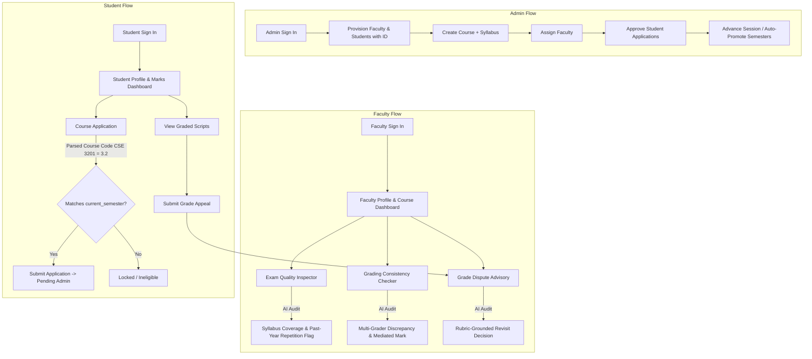

# FacultyOS — Project Details & Engineering Context

> [!IMPORTANT]
> **MANDATORY for every AI agent (Copilot, Claude Code, Antigravity, Cursor, etc.) and every human teammate:**
> - **READ** this file completely **BEFORE** implementing or modifying any code.
> - **UPDATE** this file **AFTER** every merged feature branch or schema migration.
> - **Never violate** the Architecture, Security, and Design System rules defined below.

- **Last Updated**: 2026-09-06
- **Current Phase**: AI Core Intelligence & Evaluation Interfaces
- **Event**: AUST CSE Carnival <8.0/> — AI Build Hackathon (Final Round)
- **Theme**: AI for Academic Life

---

## 1. Project Overview

**FacultyOS** is an intelligent academic co-pilot and administrative operating system engineered for university faculty, students, and departmental administrators (specifically tailored to the curriculum, semester structure, and examination policies of Ahsanullah University of Science and Technology — AUST).

Rather than generating generic boilerplate content or attempting to replace the instructor, FacultyOS functions as an **objective, rubric-grounded decision-support platform** addressing three critical friction points in academic life:

1. **Exam Question Quality & Repetition Auditing**: Verifying syllabus coverage, cognitive diversity (Bloom's Taxonomy), and identifying semantic duplication against historical past-year exam archives.
2. **Multi-Faculty Grading Discrepancy Reconciliation**: Identifying severe scoring variations and semantic grading disagreements when multiple examiners grade identical student answer scripts.
3. **Student Grade Dispute / Appeal Advisory**: Objectively evaluating student regrade petitions against the official marking rubric to provide faculty with an unbiased second opinion before final grades are submitted.
4. **End-to-End Academic Life Lifecycle**: Complete administrative governance including dynamic course-code eligibility parsing (e.g., `CSE 3201` $\rightarrow$ Semester `3.2`), student auto-promotion across university sessions, and role-segregated portals.

---

## 2. Product Goals

- **Assessment Co-Pilot**: Catch curriculum omissions and past-exam repetition in draft question papers before printing.
- **Grading Fairness**: Detect and reconcile severe multi-examiner discrepancies across co-examiners to ensure grading equity.
- **Streamlined Grade Appeals**: Automated rubric cross-examination saving faculty hours of manual regrading while maintaining academic objectivity.
- **Strict University Constraints**: Enforce AUST semester constraints ($1.1, 1.2, 2.1, 2.2, 3.1, 3.2, 4.1, 4.2$) and automated session promotion without manual data re-entry.
- **Unified Conversational Front-Door**: Slide-over Faculty Co-Pilot conversational drawer driven by structured function calling over live database archives.

---

## 3. User Roles & Permission Boundaries

| Role | Access Level | Permitted Operations | Restricted Operations |
| :--- | :--- | :--- | :--- |
| **`admin`** | Full System & Academic Admin | Provision faculty & students, create courses & syllabi, assign faculty, directly enroll students, approve/reject course applications, execute global session auto-promotion (`system_settings`). | Cannot alter examiner marks on scripts or impersonate faculty in dispute verdicts. |
| **`faculty`** | Academic & Assessment Lead | View assigned courses and enrolled student rosters, access current/past exam question banks, inspect draft exams with AI, analyze multi-grader discrepancies, review student grade disputes. | **STRICTLY BLOCKED** from student faculty evaluations (`public.evaluations`) and admin provisioning settings. |
| **`student`** | Read & Petition Only | View personal academic profile, inspect graded answer scripts & examiner comments, submit grade appeals (`grade_requests`), browse & apply for courses strictly matching their `current_semester`. | **STRICTLY BLOCKED** from faculty tools (Exam Quality, Consistency Checker, Dispute Decisions) and Admin routes. |

---

## 4. Core User Flows



---

## 5. Current Implementation Status

- **Frontend Scaffold**: Complete (Next.js 15 App Router, React 19, Tailwind CSS v4, shadcn/ui, Space Grotesk + Inter typography).
- **Authentication & RBAC**: Complete (Supabase Auth, SSR Middleware route guards, role home resolution).
- **Database Schema & Seed**: Complete (PostgreSQL on Supabase, seeded with CSE 321 Algorithms, Fall 2024 past exam, Spring 2025 draft exam, multi-grader script discrepancy, and grade dispute).
- **Admin Portal**: Complete (`feat/admin-portal`):
  - User Provisioning with auto-incremented distinct student IDs (`21.01.04.099`, `21.01.04.100`, etc.).
  - Course Creation, Faculty Assignment dropdowns, Direct Enrollment modal.
  - Student application review queue (Approve / Reject).
  - Global session tracker (`system_settings`) with auto-promotion matrix ($1.1 \rightarrow 4.2 \rightarrow \text{Graduated}$).
- **Course Eligibility Engine**: Complete (Regex parser extracting semester numbers from course codes like `CSE 3201` $\rightarrow 3.2$).
- **Student Course Registration**: Complete (`/dashboard/student/courses` with semester constraint lock and reason tooltips).
- **AI Reasoning Engine (`src/lib/ai/skills.ts`)**: In Progress / Active Build (Gemini SDK integration, JSON schema prompts for Quality, Consistency, and Appeals).
- **AI Interactive Screens**: In Progress (`/exam-quality`, `/grading-consistency`, `/grade-disputes`, `/copilot-chat`).

---

## 6. Feature Status Board

| Feature | Category | Status | Primary Implementation Files |
| :--- | :--- | :--- | :--- |
| **Role-Based Navigation & Route Guards** | Security | **DONE** | [src/lib/access-control.ts](file:///d:/Hackathon/src/lib/access-control.ts), [src/lib/supabase/middleware.ts](file:///d:/Hackathon/src/lib/supabase/middleware.ts), [src/components/Navbar.tsx](file:///d:/Hackathon/src/components/Navbar.tsx) |
| **Admin User Provisioning** | Administration | **DONE** | [src/app/dashboard/admin/users/page.tsx](file:///d:/Hackathon/src/app/dashboard/admin/users/page.tsx), [src/components/admin/UserDirectoryManager.tsx](file:///d:/Hackathon/src/components/admin/UserDirectoryManager.tsx), [src/app/actions/admin.ts](file:///d:/Hackathon/src/app/actions/admin.ts) |
| **Course Management & Faculty Assignment** | Administration | **DONE** | [src/app/dashboard/admin/courses/page.tsx](file:///d:/Hackathon/src/app/dashboard/admin/courses/page.tsx), [src/components/admin/CourseCatalogManager.tsx](file:///d:/Hackathon/src/components/admin/CourseCatalogManager.tsx), [src/components/admin/AssignFacultyModal.tsx](file:///d:/Hackathon/src/components/admin/AssignFacultyModal.tsx) |
| **Application Approval Queue & Direct Enroll** | Administration | **DONE** | [src/app/dashboard/admin/enrollments/page.tsx](file:///d:/Hackathon/src/app/dashboard/admin/enrollments/page.tsx), [src/components/admin/EnrollmentManager.tsx](file:///d:/Hackathon/src/components/admin/EnrollmentManager.tsx), [src/components/admin/DirectEnrollModal.tsx](file:///d:/Hackathon/src/components/admin/DirectEnrollModal.tsx) |
| **Semester Constraints & Course Parsing** | Academic Rules | **DONE** | [src/lib/semester-utils.ts](file:///d:/Hackathon/src/lib/semester-utils.ts), [src/components/student/StudentCourseApplicationView.tsx](file:///d:/Hackathon/src/components/student/StudentCourseApplicationView.tsx) |
| **Global Session Auto-Promotion** | Administration | **DONE** | [src/app/dashboard/admin/settings/page.tsx](file:///d:/Hackathon/src/app/dashboard/admin/settings/page.tsx), [src/components/admin/SessionSettingsManager.tsx](file:///d:/Hackathon/src/components/admin/SessionSettingsManager.tsx) |
| **Student Course Application Flow** | Student Life | **DONE** | [src/app/dashboard/student/courses/page.tsx](file:///d:/Hackathon/src/app/dashboard/student/courses/page.tsx), [src/app/actions/student.ts](file:///d:/Hackathon/src/app/actions/student.ts) |
| **Exam Question Quality & Repetition Inspector** | AI Core | **IN PROGRESS** | `src/lib/ai/skills.ts`, [src/app/exam-quality/page.tsx](file:///d:/Hackathon/src/app/exam-quality/page.tsx) |
| **Multi-Grader Consistency Checker** | AI Core | **IN PROGRESS** | `src/lib/ai/skills.ts`, [src/app/grading-consistency/page.tsx](file:///d:/Hackathon/src/app/grading-consistency/page.tsx) |
| **Student Grade Dispute Review** | AI Core | **IN PROGRESS** | `src/lib/ai/skills.ts`, [src/app/grade-disputes/page.tsx](file:///d:/Hackathon/src/app/grade-disputes/page.tsx) |
| **Unified Co-Pilot Chatbot** | AI Core | **IN PROGRESS** | [src/app/copilot-chat/page.tsx](file:///d:/Hackathon/src/app/copilot-chat/page.tsx), `src/components/FacultyChatbot.tsx` |

---

## 7. Technology Stack

- **Framework**: Next.js 15.1.x / 15.5.x (App Router, Server Actions, Route Handlers)
- **Language**: TypeScript 5.7.x (Strict mode, zero `any` policy)
- **UI Library**: React 19.0.0
- **Styling**: Tailwind CSS v4.0.0
- **Design System / Primitives**: shadcn/ui (New York style, Zinc neutral scale) + Radix UI Primitives
- **Icons**: `lucide-react` exclusively (**Emojis as UI icons are strictly banned**)
- **Backend / Database**: Supabase PostgreSQL + Supabase Realtime + Supabase Auth
- **Admin Authentication Operations**: `@supabase/supabase-js` (via Server Actions utilizing `SUPABASE_SERVICE_ROLE_KEY`)
- **AI Reasoning Engine**: Google Gemini API (`@google/genai` SDK, Model: `gemini-2.5-flash`)
- **Typography**: Space Grotesk (Headings) & Inter (Body, Data, and Tabular figures)
- **Notifications**: `sonner` toasts

---

## 8. System Architecture

```
┌────────────────────────────────────────────────────────────────────────┐
│                               BROWSER                                  │
│  Role-Guarded Portals: /dashboard/admin · /dashboard/student/courses   │
│  Core AI Screens: /exam-quality · /grading-consistency · /grade-disputes│
│  Co-Pilot Front-Door: /copilot-chat · Server Actions · Sonner Toasts   │
└───────────────────┬────────────────────────────────┬───────────────────┘
                    │ Server Actions & API Calls     │ Client Session
                    ▼                                ▼
┌────────────────────────────────────────────────────────────────────────┐
│                        NEXT.JS 15 APP RUNTIME                          │
│  Middleware Auth Guards (src/lib/supabase/middleware.ts)               │
│  Dynamic Semester Parser (src/lib/semester-utils.ts)                   │
│  AI Skills Engine (src/lib/ai/skills.ts) -> Gemini 2.5 Flash           │
│  Admin Privileged Server Actions (src/app/actions/admin.ts)           │
│  Student Course Actions (src/app/actions/student.ts)                   │
└───────────────────┬────────────────────────────────┬───────────────────┘
                    │ Service Role (Admin Ops)       │ Anon Key (User RLS)
                    ▼                                ▼
┌────────────────────────────────────────────────────────────────────────┐
│                         SUPABASE POSTGRESQL                            │
│  profiles · courses · syllabi · exams · exam_questions                 │
│  answer_scripts · grades · grade_requests · course_applications        │
│  system_settings · chat_logs                                           │
└────────────────────────────────────────────────────────────────────────┘
```

---

## 9. Database Architecture & Schema Specification

All database tables are housed in the `public` schema on Supabase:

### 1. `profiles`
Identity profile mapped to Supabase `auth.users`:
- `id` (`UUID`, PK, `DEFAULT gen_random_uuid()`)
- `auth_user_id` (`UUID`, nullable, references `auth.users.id`)
- `email` (`TEXT`, UNIQUE, NOT NULL)
- `full_name` (`TEXT`, NOT NULL)
- `role` (`TEXT`, CHECK: `'faculty' | 'student' | 'admin'`, `DEFAULT: 'faculty'`)
- `department` (`TEXT`, `DEFAULT: 'CSE'`)
- `student_id_number` (`TEXT`, UNIQUE, nullable — e.g. `'21.01.04.099'`, immutable once provisioned)
- `current_semester` (`TEXT`, CHECK: `'1.1' | '1.2' | '2.1' | '2.2' | '3.1' | '3.2' | '4.1' | '4.2' | 'Graduated'`)
- `created_at` (`TIMESTAMPTZ`, `DEFAULT: NOW()`)

### 2. `courses`
University curriculum course catalog:
- `id` (`TEXT`, PK — e.g. `'cse-321'`)
- `code` (`TEXT`, UNIQUE, NOT NULL — e.g. `'CSE 3201'`, `'CSE 321'`)
- `title` (`TEXT`, NOT NULL — e.g. `'Algorithms'`)
- `description` (`TEXT`, nullable)
- `learning_objectives` (`JSONB`, array of `{ clo, description, blooms_level }`)
- `faculty_id` (`UUID`, references `profiles.id` on delete set null)
- `faculty_name` (`TEXT`, `DEFAULT: 'Dr. Tanvir Rahman'`)
- `assigned_faculty` (`JSONB`, array of `{ faculty_id, name, email, role }`)
- `enrolled_count` (`INT`, `DEFAULT: 0`)
- `enrolled_students` (`JSONB`, array of `{ student_id, student_name, email, status }`)
- `created_at` (`TIMESTAMPTZ`, `DEFAULT: NOW()`)

### 3. `syllabi`
Course topic registry for coverage calculation:
- `id` (`UUID`, PK, `DEFAULT gen_random_uuid()`)
- `course_id` (`TEXT`, references `courses.id` on delete cascade)
- `topics` (`JSONB`, array of strings — e.g. `["Dynamic Programming", "MST", "Greedy Algorithms", "NP-Completeness"]`)
- `updated_at` (`TIMESTAMPTZ`, `DEFAULT: NOW()`)

### 4. `exams` & `exam_questions`
Examination papers and historical archives:
- `exams`: `id` (`TEXT`, PK), `course_id` (`TEXT`), `semester` (`TEXT` — e.g. `'Fall 2024'`), `exam_type` (`'midterm' | 'final' | 'quiz'`), `total_marks` (`INT`), `created_at`.
- `exam_questions`: `id` (`UUID`, PK), `exam_id` (`TEXT`, references `exams.id`), `question_number` (`INT`), `question_text` (`TEXT`), `topic_tag` (`TEXT`), `target_blooms` (`TEXT`), `marks` (`INT`).

### 5. `answer_scripts` & `grades`
Multi-faculty graded student answers:
- `answer_scripts`: `id` (`TEXT`, PK — e.g. `'script-001'`), `exam_id` (`TEXT`), `student_name` (`TEXT`), `student_id_number` (`TEXT`), `question_number` (`INT`), `question_text` (`TEXT`), `student_answer` (`TEXT`), `rubric_guidelines` (`TEXT`), `created_at`.
- `grades`: `id` (`UUID`, PK), `script_id` (`TEXT`, references `answer_scripts.id`), `grader_name` (`TEXT`), `grader_role` (`TEXT`), `score_awarded` (`NUMERIC(5,2)`), `max_score` (`NUMERIC(5,2)`), `feedback` (`TEXT`), `graded_at`.

### 6. `grade_requests`
Student grade appeals and AI advisory verdicts:
- `id` (`TEXT`, PK — e.g. `'req-101'`), `script_id` (`TEXT`), `student_name` (`TEXT`), `student_reason` (`TEXT`), `status` (`'pending' | 'under_review' | 'resolved'`), `ai_recommendation` (`JSONB`), `faculty_decision` (`TEXT`), `created_at`.

### 7. `course_applications`
Student enrollment application pipeline:
- `id` (`UUID`, PK, `DEFAULT gen_random_uuid()`), `student_id` (`UUID`, references `profiles.id`), `course_id` (`TEXT`, references `courses.id`), `status` (`'pending' | 'approved' | 'rejected'`), `applied_at` (`TIMESTAMPTZ`), `reviewed_at` (`TIMESTAMPTZ`), `notes` (`TEXT`).
- Constraint: `UNIQUE(student_id, course_id)`.

### 8. `system_settings`
Global session and academic year tracker:
- `id` (`SERIAL`, PK), `current_session` (`TEXT` — e.g. `'Spring 2025'`), `updated_at` (`TIMESTAMPTZ`).

### 9. `chat_logs`
Audit log of all AI skill executions and co-pilot queries:
- `id` (`UUID`, PK), `skill_used` (`TEXT`), `user_prompt` (`TEXT`), `ai_response` (`JSONB`), `created_at`.

---

## 10. Authentication, Authorization & Session Hydration

- **Authentication Layer**: Supabase Auth handles identity.
- **Session Hydration**: The caller's profile is fetched via `auth_user_id = user.id` with fallback to `email = user.email` to support pre-seeded hackathon accounts.
- **Route Protection ([src/lib/access-control.ts](file:///d:/Hackathon/src/lib/access-control.ts) & [src/lib/supabase/middleware.ts](file:///d:/Hackathon/src/lib/supabase/middleware.ts))**:
  - `/dashboard/admin/*` $\rightarrow$ Allowed only for `role === 'admin'`.
  - `/dashboard/student/*` $\rightarrow$ Allowed for `student` & `admin`.
  - `/exam-quality`, `/grading-consistency`, `/copilot-chat` $\rightarrow$ Allowed for `faculty` & `admin`.
  - `/grade-disputes` $\rightarrow$ Allowed for `admin`, `faculty`, & `student`.
- **Service Role Security**: The `SUPABASE_SERVICE_ROLE_KEY` is strictly accessed in server-side server actions ([src/app/actions/admin.ts](file:///d:/Hackathon/src/app/actions/admin.ts)) and is never exposed in client bundles.

---

## 11. Academic Business Logic & Rule Engine

### Course Code Eligibility Parser ([src/lib/semester-utils.ts](file:///d:/Hackathon/src/lib/semester-utils.ts))
AUST course codes encode the academic year and semester:
- **Format**: `[DEPT] [YEAR][SEMESTER][DIGIT][DIGIT]` (e.g., `CSE 3201` or `CSE 321`).
- **Parsing Rule**: The first digit represents Year (1–4), and the second digit represents Semester (1 or 2).
  - `CSE 3201` $\rightarrow$ Year 3, Semester 2 $\rightarrow$ Semester `3.2`.
  - `CSE 1100` $\rightarrow$ Year 1, Semester 1 $\rightarrow$ Semester `1.1`.
  - `CSE 4111` $\rightarrow$ Year 4, Semester 1 $\rightarrow$ Semester `4.1`.
- **Eligibility Check**: A student can only click **"Apply for Course"** if the parsed course semester matches their `profiles.current_semester`. Otherwise, the button is disabled with a lock tooltip:
  > *"You can only apply to courses in semester [3.2]. Your current semester is [student.current_semester]."*

### Automated Semester Promotion Logic
Triggered by the Admin clicking **"Start New Semester Session"** ([src/app/actions/admin.ts](file:///d:/Hackathon/src/app/actions/admin.ts)):
1. Advances session string (e.g., `Spring 2025` $\rightarrow$ `Fall 2025`).
2. Iterates over all student profiles and logically increments semester:
   $$1.1 \rightarrow 1.2 \rightarrow 2.1 \rightarrow 2.2 \rightarrow 3.1 \rightarrow 3.2 \rightarrow 4.1 \rightarrow 4.2 \rightarrow \text{Graduated}$$

---

## 12. AI Reasoning Engine Architecture (`src/lib/ai/skills.ts`)

All AI capabilities use Google Gemini (`gemini-2.5-flash`) configured with strict JSON output schemas (`responseMimeType: 'application/json'`):

### Skill 1: Exam Question Quality & Repetition Inspector
- **Inputs**: `courseId`, array of draft question strings.
- **Data Ingestion**: Pulls syllabus topics from `syllabi` and previous exam questions from `exam_questions` (e.g., Fall 2024 archive).
- **Reasoning**:
  - Computes syllabus coverage vector (identifies unaddressed topics such as "Greedy Algorithms").
  - Measures semantic similarity against past questions. Flags similarity $> 65\%$ with matched exam semester and question number.
  - Classifies questions according to Bloom's Taxonomy (Remember, Understand, Apply, Analyze, Evaluate).
- **Output**: JSON containing `overall_coverage_pct`, `covered_topics`, `missing_topics`, `repetition_flags`, and `diversity_assessment`.

### Skill 2: Multi-Faculty Grading Consistency Checker
- **Inputs**: `scriptId` (e.g., `'script-001'`).
- **Data Ingestion**: Pulls student answer, official rubric breakdown, and all grader entries from `grades`.
- **Reasoning**: Compares scores (e.g., Dr. Tanvir's 10/15 vs. Lecturer Hasan's 4/15) against rubric sub-component weights. Detects if an examiner applied an overly harsh penalty for a missing sub-step when the theoretical derivation was correct.
- **Output**: JSON containing `score_spread`, `severity` (`LOW | MODERATE | CRITICAL`), `discrepancy_diagnosis`, and `recommended_score` (mediated consensus).

### Skill 3: Student Grade Appeal / Regrade Advisory
- **Inputs**: `requestId` (e.g., `'req-101'`).
- **Data Ingestion**: Pulls student's written reason, original grade, student answer text, and rubric.
- **Reasoning**: Evaluates whether the student's argument has merit based strictly on rubric checkpoints.
- **Output**: JSON containing verdict (`"Faculty Revisit Recommended"` | `"Original Grade Upheld"`), confidence ($0.0 - 1.0$), `suggested_adjustment`, and reasoning.

---

## 13. Exact Repository File Tree

```
FacultyOS/
├── src/
│   ├── app/
│   │   ├── actions/
│   │   │   ├── admin.ts                 # Privileged admin actions (users, courses, sessions)
│   │   │   └── student.ts               # Student course application & constraint validation
│   │   ├── api/
│   │   │   └── auth/signup/route.ts     # User registration endpoint
│   │   ├── auth/
│   │   │   ├── [role]/login/page.tsx    # Role-based login routes
│   │   │   ├── [role]/signup/page.tsx   # Role-based signup routes
│   │   │   └── page.tsx                 # Auth landing hub
│   │   ├── copilot-chat/page.tsx        # Unified Front-Door AI Co-Pilot chat
│   │   ├── dashboard/
│   │   │   ├── admin/
│   │   │   │   ├── courses/page.tsx     # Course catalog & faculty assignments
│   │   │   │   ├── enrollments/page.tsx # Student petition review & direct enrollment
│   │   │   │   ├── settings/page.tsx    # Session management & auto-promotion
│   │   │   │   ├── users/page.tsx       # Faculty & student user provisioning
│   │   │   │   └── page.tsx             # System Administrator Overview Command Center
│   │   │   └── student/
│   │   │       └── courses/page.tsx     # Student course registration & semester constraint lock
│   │   ├── exam-quality/page.tsx        # Core Skill 1: Exam Question Quality & Repetition
│   │   ├── grading-consistency/page.tsx # Core Skill 2: Multi-Grader Consistency Checker
│   │   ├── grade-disputes/page.tsx      # Core Skill 3: Grade Dispute & Appeal Advisory
│   │   ├── globals.css                  # Tailwind CSS v4 & theme variables
│   │   ├── layout.tsx                   # Root layout with Toaster & ThemeProvider
│   │   └── page.tsx                     # Landing page & value proposition
│   ├── components/
│   │   ├── admin/
│   │   │   ├── AssignFacultyModal.tsx   # Faculty instructor assignment modal
│   │   │   ├── CourseCatalogManager.tsx # Course catalog table & grid manager
│   │   │   ├── CourseRosterViewer.tsx   # Active course cohort viewer with revocation
│   │   │   ├── CreateCourseModal.tsx    # Course & syllabus initialization modal
│   │   │   ├── CreateFacultyModal.tsx   # Faculty account provisioning modal
│   │   │   ├── CreateStudentModal.tsx   # Student account provisioning modal
│   │   │   ├── DirectEnrollModal.tsx    # Manual direct enrollment modal
│   │   │   ├── EditCourseModal.tsx      # Course title & description editor
│   │   │   ├── EnrollmentManager.tsx    # Applications queue adjudication manager
│   │   │   ├── SessionSettingsManager.tsx# Active session & auto-promotion manager
│   │   │   └── UserDirectoryManager.tsx # Accounts directory table with filters
│   │   ├── auth/AuthButton.tsx          # Dynamic sign-in / sign-out button
│   │   ├── student/
│   │   │   └── StudentCourseApplicationView.tsx # Student course catalog with semester constraints
│   │   ├── ui/                          # shadcn/ui primitives (badge, button, dialog, table, tabs, skeleton)
│   │   ├── mode-toggle.tsx              # Light / Dark mode toggle
│   │   ├── theme-provider.tsx           # Next-themes wrapper
│   │   └── Navbar.tsx                   # Role-aware persistent navigation bar
│   └── lib/
│       ├── access-control.ts            # Route permission mapping & role home resolution
│       ├── auth-roles.ts                # Role type helpers & cookie hydration
│       ├── semester-utils.ts            # Course code parser & semester progression logic
│       ├── utils.ts                     # cn() class utility
│       └── supabase/
│           ├── admin.ts                 # Service-role admin client (server-only)
│           ├── client.ts                # Browser Supabase client
│           ├── config.ts                # Environment keys & configuration
│           ├── middleware.ts            # SSR session refresh & route redirect
│           ├── server.ts                # Server component Supabase client
│           └── types.ts                 # TypeScript interfaces for all Supabase tables
├── supabase/
│   ├── admin_portal.sql                 # Course applications & faculty_id migration
│   ├── admin_provisioning.sql           # Student ID numbers, semesters & system_settings migration
│   ├── auth.sql                         # Authentication helper functions
│   ├── full_setup.sql                   # Complete relational setup script
│   ├── schema.sql                       # Core schema DDL
│   └── seed.sql                         # Realistic demo seed data
├── scripts/
│   ├── seed-admin.mjs                   # Admin user seed utility
│   ├── test-auth.mjs                    # Authentication test harness
│   └── test-supabase.mjs                # Supabase table connectivity audit
├── BATTLE_PLAN.md                       # Task-by-task execution guide & demo script
├── AGENTS.md                            # Universal AI coding agent rules
├── projectdetails.md                    # System Architecture & Source of Truth
└── README.md                            # Public setup & judging instructions
```

---

## 14. Development Rules & Design Tokens

- **Never Fake Backend Functionality**: If an API or database table exists, query it. Never replace database mutations with `setTimeout` mocks in finished components.
- **Never Hallucinate Schema Columns**: Check `schema.sql`, `admin_portal.sql`, and `admin_provisioning.sql` before writing SQL queries or TypeScript interfaces.
- **Preserve Established Academic Design Tokens**:
  - **Primary**: Deep Academic Navy (`#0F2942`)
  - **Accent / Warning**: Warm Amber (`#F59E0B`)
  - **Danger / Repetition Alert**: Crimson (`#DC2626`)
  - **Success / Enrolled**: Emerald (`#16A34A`)
  - **Base Neutrals**: Zinc Dark Mode (`#09090B`) / Crisp Light Mode (`#FFFFFF`)
- **Use Lucide Icons Exclusively**: Emojis are strictly banned as UI icons.
- **Enforce Role Boundaries**: Always verify user role before exposing clinical/faculty evaluation actions.
- **Smallest Safe Diff**: Make focused, modular edits. Never overwrite or reformat entire working components unnecessarily.

---

## 15. Security Rules & Row-Level Security (RLS)

- **Row-Level Security**: Enabled on all tables (`profiles`, `courses`, `syllabi`, `exams`, `exam_questions`, `answer_scripts`, `grades`, `grade_requests`, `course_applications`, `system_settings`, `chat_logs`).
- **Development Policy**: Permissive authenticated access is maintained during the hackathon to eliminate unexpected 403 Forbidden errors during live judge presentations.
- **Service Role Key**: The `SUPABASE_SERVICE_ROLE_KEY` must never be used in client components (`'use client'`). It is strictly restricted to server actions in `src/app/actions/`.
- **Faculty Evaluation Guard**: Student evaluation forms are restricted from faculty interfaces to preserve anonymous student feedback integrity.

---

## 16. Git & Collaboration Workflow

- **Feature branches**: `feat/feature-name` (e.g., `feat/admin-portal`, `feat/ai-academic-core`).
- **Commits**: Follow conventional commits (`feat:`, `fix:`, `chore:`, `docs:`).
- **Build check**: Run `npx tsc --noEmit` and `npm run build` prior to merging any branch into `main`.
- **Clean clone rule**: Ensure the repository boots without errors from a fresh clone using `.env.example`.

---

## 17. Environment & Configuration

Create `.env.local` or `.env` based on `.env.example`:

```bash
NEXT_PUBLIC_SUPABASE_URL="https://your-project.supabase.co"
NEXT_PUBLIC_SUPABASE_ANON_KEY="your-anon-key"
SUPABASE_SERVICE_ROLE_KEY="your-server-only-service-role-key"
GEMINI_API_KEY="your-google-gemini-api-key"
```

---

## 18. Testing & Demo Strategy (The Winning 2-Minute Script)

### Step 1: Admin Course & Enrollment Provisioning (30s)
1. Sign in as `admin@facultyos.edu`.
2. Show the **Admin Command Center** metrics.
3. Demonstrate **Direct Student Enrollment** enrolling Sabbir Ahmed into `CSE 3201`.
4. Show the **Session Settings** auto-promotion matrix ($1.1 \rightarrow 4.2$).

### Step 2: Student Semester Constraint (25s)
1. Sign in as `sabbir.210104099@aust.edu` (Semester `3.2`).
2. Go to **Course Applications** (`/dashboard/student/courses`): Show that `CSE 3201` (Semester 3.2) is **Eligible**, while courses in other semesters are **Locked** by the dynamic course code parser with a clear tooltip.
3. Show exam marks on Script #001 (4.0/15.0) and trigger a Grade Appeal.

### Step 3: Exam Question Quality & Repetition Inspector (35s)
1. Sign in as `tanvir.cse@aust.edu` (Faculty).
2. Go to `/exam-quality` $\rightarrow$ Click "Load Sample Draft Exam".
3. Click "Inspect Assessment Quality":
   - AI detects **88% Repetition** on Question 1 vs. Fall 2024 Exam archive (MST uniqueness proof).
   - Coverage progress bar highlights that Dynamic Programming was over-tested while Greedy Algorithms was omitted.

### Step 4: Multi-Grader Consistency Checker (30s)
1. Open `/grading-consistency` $\rightarrow$ Select Script #001.
2. Show the 6-mark divergence: Dr. Tanvir (10/15) vs. Lecturer Hasan (4/15).
3. AI diagnoses that the co-examiner penalized missing backtracking across the entire question, violating rubric weighting. AI recommends a mediated consensus mark of **9.5 / 15.0**.

---

## 19. Important Decisions Log

| ID | Date | Decision | Rationale |
| :--- | :--- | :--- | :--- |
| **D-001** | 2026-09-06 | Stack: Next.js 15 App Router + React 19 + Tailwind v4 + Supabase + Gemini | Provides instant full-stack capabilities, server actions, real-time database, and fast JSON LLM reasoning in one repository. |
| **D-002** | 2026-09-06 | Single Co-Pilot Front-Door Architecture | Rather than building disconnected apps, everything is unified through one role-aware dashboard and a slide-over Co-Pilot conversational drawer. |
| **D-003** | 2026-09-06 | Distinct Sequential Student ID Generation | Prevents PostgreSQL unique key collisions on `profiles_student_id_number_key` during initial database population. |
| **D-004** | 2026-09-06 | Dynamic Regex Course Code Parsing (`CSE 3201` $\rightarrow$ `3.2`) | Avoids hardcoding course-to-semester lookup tables and mirrors real AUST university academic numbering rules. |
| **D-005** | 2026-09-06 | AI Remains Advisory (Zero Autonomous Grade Changes) | In accordance with the hackathon problem statement ("give faculty a better tool, don't replace them"), AI verdicts require human faculty approval. |
| **D-006** | 2026-09-06 | Permissive RLS Policies During Development | Eliminates unexpected 403 Forbidden errors during live judge presentations while maintaining role security in server-side middleware. |

---

## 20. Instructions for AI Coding Agents

1. **Read `projectdetails.md` and `BATTLE_PLAN.md`** before generating code.
2. **Inspect existing files in `src/`** to prevent duplicate implementations or conflicting patterns.
3. **Verify table and column names** against Section 9 before writing database queries.
4. **Do not create mock data arrays** inside production pages when Supabase tables are ready.
5. **Preserve established theme tokens**: Navy (`#0F2942`), Amber (`#F59E0B`), Crimson (`#DC2626`), Emerald (`#16A34A`).
6. **Report modified files, verified build status, and remaining tasks** upon every task completion.
7. **Stop and prompt the human developer** only if missing required API keys or facing destructive migration conflicts.

---

## 21. Next Immediate Tasks

1. **Complete `src/lib/ai/skills.ts`**: Verify Google GenAI integration with `gemini-2.5-flash` using structured JSON schemas.
2. **Wire Exam Quality Inspector (`/exam-quality`)**: Connect "Inspect Assessment Quality" button to live AI evaluation.
3. **Wire Grading Consistency Checker (`/grading-consistency`)**: Connect "Analyze Grader Discrepancy" button to live AI evaluation.
4. **Wire Grade Disputes Review (`/grade-disputes`)**: Connect dispute re-evaluation to live AI evaluation.
5. **Implement Slide-Over Co-Pilot (`src/components/FacultyChatbot.tsx`)**: Wire Gemini function calling to allow natural language execution of the three core skills.
6. **Execute Final Production Build**: Run `npm run build` to verify zero errors across all routes prior to submission.